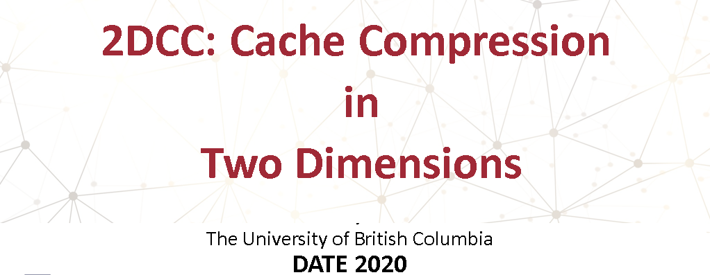

The importance of caches for performance, and their high silicon area cost, have motivated hardware solutions that transparently compress the cached data to increase effective capacity without sacrificing silicon area.
 To this end, prior work has taken one of two approaches: either (a) deduplicating identical cache blocks across the cache to take advantage of inter-block redundancy or (b) compressing common patterns within each cache block to take advantage of intra-block redundancy
 In this paper, we demonstrate that leveraging only one of these redundancy types leads to a significant loss in compression opportunities for several applications: some workloads exhibit either inter-block or intra-block redundancy, while others exhibit both.
 We propose 2DCC (Two Dimensional Cache Compression), a simple technique that takes advantage of both types of redundancy. Across the SPEC and Parsec benchmark suites, 2DCC results in a 2.12× compression factor (geomean) compared to 1.44-1.49× for best prior techniques on an iso-silicon basis.
 For the cache-sensitive subset of these benchmarks run in isolation, 2DCC also achieves a 11.7% speedup (geomean).

Paper link here: [2DCC: Cache Compression in Two Dimensions](https://ieeexplore.ieee.org/document/9116279)

# Cache Compression zsim
This is a variation of the original [zsim simulator](https://github.com/s5z/zsim) that supports compressed caches. I built this in collaboration with [Amin Ghasemazar](https://github.com/Amin-Azar) at UBC, under the supervision of Prof. [Mieszko Lis](http://mieszko.ece.ubc.ca/). This work was part of my [MSc thesis](https://open.library.ubc.ca/cIRcle/collections/ubctheses/24/items/1.0368685) and an updated version of this simulator has been used in the two following papers:

## Caches
This simulator includes different types of compressed caches:
- [Doppelganger Cache](https://ieeexplore.ieee.org/document/7856587)
- [Base Delta Immediate Cache](https://ieeexplore.ieee.org/document/7842950)
- [Deduplication Cache](https://dl.acm.org/doi/10.1145/2597652.2597655), and an ideal version of deduplication cache that knows exactly what to deduplicate without the use of hashing.
- A combined base delta immediate + deduplication cache as art of our work, and an ideal version similar to the one with deduplication cache

Main Classes: Please refer to `approximatebdi_cache.cpp`, `approximatebdi_cache.h`, `approximatededup_cache.cpp`, `approximatededup_cache.h`, `approximatededupbdi_cache.cpp` and `approximatededupbdi_cache.h`
